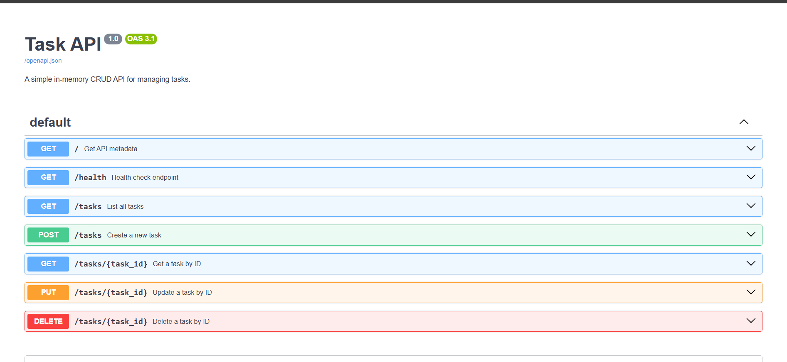

# Task API

A lightweight RESTful CRUD API built with Python and FastAPI, backed by a SQLite database (`tasks.db`).

---

## 💾 Why SQLite Was Chosen
* **Zero Configuration:** Lightweight file-based relational database requiring no separate server process.
* **Persistence:** Data survives application restarts and persists locally in `tasks.db`.
* **Automatic Creation:** Database and tables are generated automatically on startup.

---

## 🚀 How to Run

1. **Clone the repository:**
   ```bash
   git clone <YOUR-GITHUB-REPO-URL>
   cd task-api
   ```

2. **Set up virtual environment & install dependencies:**
   ```bash
   python -m venv .venv
   source .venv/bin/activate  # On Windows: .venv\Scripts\activate
   pip install fastapi uvicorn
   ```

3. **Start the server:**
   ```bash
   uvicorn main:app --reload --port 8000
   ```

---

## 📑 API Endpoints

| Method | Endpoint | Description | Status Codes |
| :--- | :--- | :--- | :--- |
| `GET` | `/tasks` | List all tasks | 200 |
| `GET` | `/tasks/{id}` | Get task by ID | 200, 404 |
| `POST` | `/tasks` | Create task | 201, 400 |
| `PUT` | `/tasks/{id}` | Update task | 200, 400, 404 |
| `DELETE` | `/tasks/{id}` | Delete task | 204, 404 |

---

## 📊 Executed SQL Example

```sql
SELECT * FROM tasks WHERE done = 1;
```
*Returns all tasks where the completed status flag is set to 1 (True).*

---

## 📸 Screenshots

### Database Viewer (DB Browser for SQLite)


### Swagger UI
