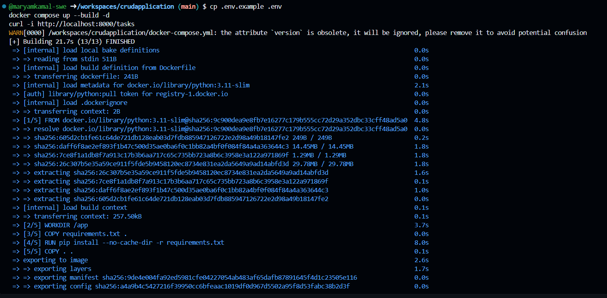
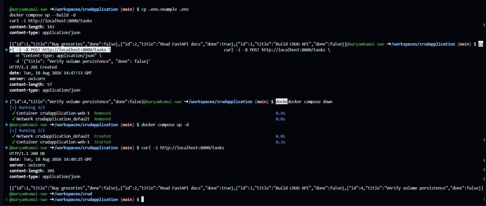
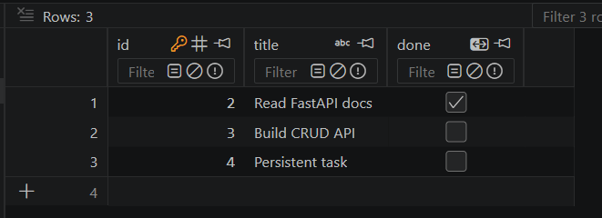
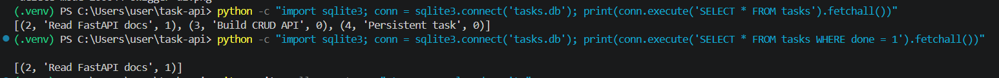

# Task API

A lightweight RESTful CRUD API built with Python and FastAPI, backed by a SQLite database (`tasks.db`).

---

## 💾 Why SQLite Was Chosen
* **Zero Configuration:** Lightweight file-based relational database requiring no separate server process.
* **Persistence:** Data survives application restarts and persists locally in `tasks.db`.
* **Automatic Creation:** Database and tables are generated automatically on startup.

---

## 🚀 How to Run

1. **Clone the repository:**
   ```bash
   git clone <YOUR-GITHUB-REPO-URL>
   cd task-api
   ```

2. **Set up virtual environment & install dependencies:**
   ```bash
   python -m venv .venv
   source .venv/bin/activate  # On Windows: .venv\Scripts\activate
   pip install fastapi uvicorn
   ```

3. **Start the server:**
   ```bash
   uvicorn main:app --reload --port 8000
   ```

---


## Option 2: Docker / GitHub Codespaces
**Launch the container stack:**

```bash
docker compose up -d 
```
**Verify container status:**

```bash
docker ps
```

The API will be available at `http://localhost:8000`.

---

## 📑 API Endpoints

| HTTP Method | Endpoint | Description | Expected Status Codes |
| :--- | :--- | :--- | :--- |
| `GET` | `/` | API Metadata | 200 |
| `GET` | `/health` | Server Health Check | 200 |
| `GET` | `/tasks` | Retrieve all tasks | 200 |
| `GET` | `/tasks/{id}` | Retrieve a single task by ID | 200, 404 |
| `POST` | `/tasks` | Create a new task (validates `title`) | 201, 400 |
| `PUT` | `/tasks/{id}` | Update an existing task | 200, 400, 404 |
| `DELETE` | `/tasks/{id}` | Delete a task by ID | 204, 404 |

---

## 💻 Sample `curl -i` Request & Response

```http
HTTP/1.1 200 OK
date: Tue, 18 Aug 2026 12:45:00 GMT
server: uvicorn
content-length: 122
content-type: application/json

[
  {"id":1,"title":"Buy groceries","done":false},
  {"id":2,"title":"Read FastAPI docs","done":true},
  {"id":3,"title":"Build CRUD API","done":false}
]
```

## 📊 Executed SQL Example

```sql
SELECT * FROM tasks WHERE done = 1;
```
*Returns all tasks where the completed status flag is set to 1 (True).*

---

## 💾 Persistence Proof
Verified data persistence across container resets by creating a record, tearing down the Docker container stack with docker compose down, restarting with docker compose up -d, and confirming task retention via GET /tasks.

## 📸 Screenshots
### Docker


### Database Viewer (SQLite - VS Code Extension)




### Swagger UI
